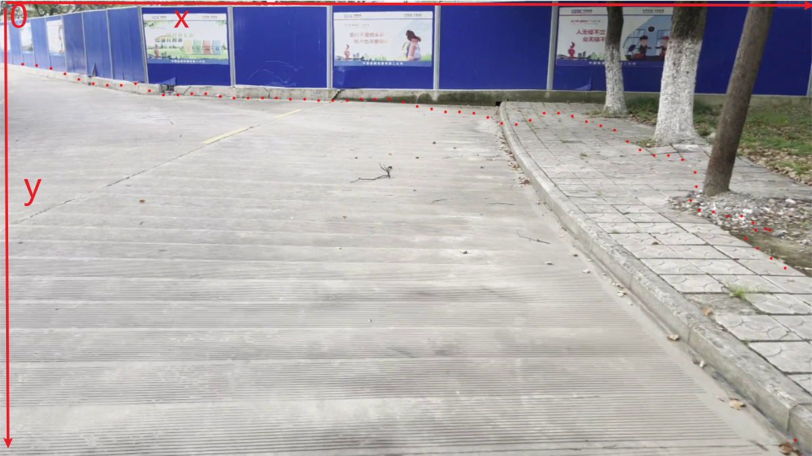

## 使用说明

### 参数介绍

道路边缘点提取已经整合成了一个RoadBoundGetter类

这个类的主要初始化选项为：

+ GPU_use：bool    .True表示使用GPU,False表示使用CPU

+ density:int      .道路采样的密度，值越大，道路边缘点越少

+ pretrain：string    .预训练权重文件的名称，代码会自动搜索预训练权重路径

+ scale：float     .原图的长宽缩小到原来的几倍后再运算

使用时先用初始化模型，比如model=RoadBoundGetter(scale=0.3,density=10)

然后输入要处理的图片，比如out=model(frame)

最后得到一个列表，列表的元素是二元组，二元组中第一个值表示边缘点在原图中的x坐标，第二个值表示边缘点在原图中的y坐标，坐标系如下：

test.py为使用实例，它的作用是读取4.mp4然后在上面画出道路边缘点。

roadbound.py为模型代码

### 注意事项

+ density参数值越大道路的点越少，道路的轮廓越不清晰
+ scale的值越小，运算的速度越快，但是精度会下降
+ 预训练权重直接放到roadbound.py所在的同级目录或其子目录中即可，我弄了自动搜索预训练权重文件。