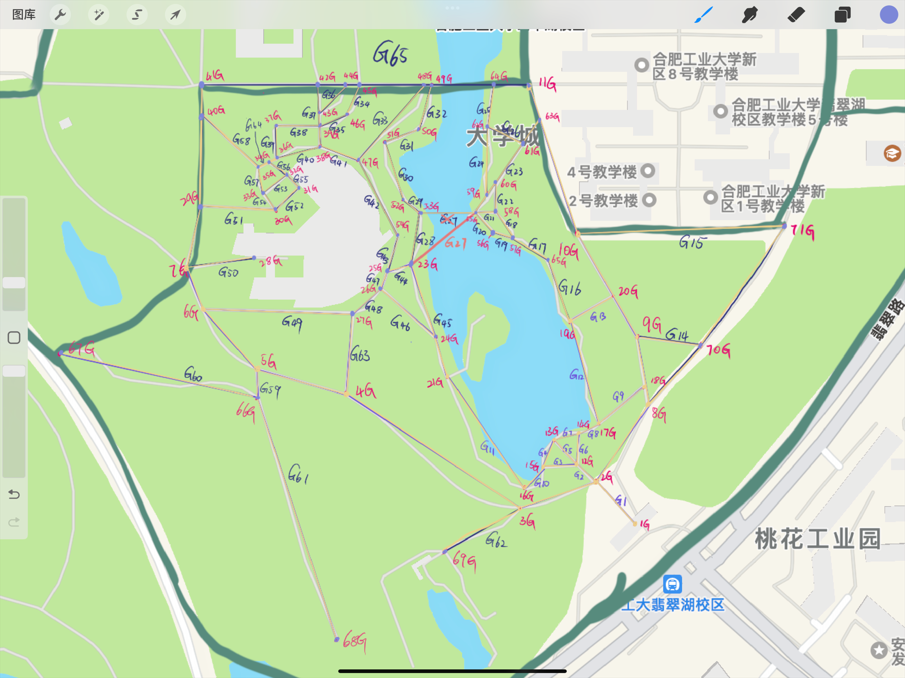
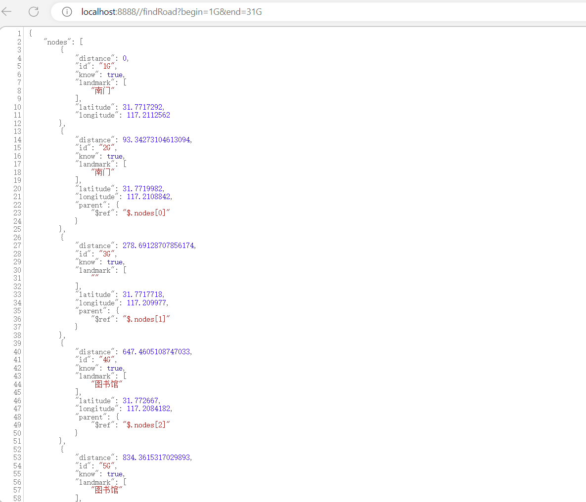

从图中1G到31G的路线如下：

返回的完整json如下：

{
"nodes": [
{
"distance": 0,
"id": "1G",
"know": true,
"landmark": [
"南门"
],
"latitude": 31.7717292,
"longitude": 117.2112562
},
{
"distance": 93.34273104613094,
"id": "2G",
"know": true,
"landmark": [
"南门"
],
"latitude": 31.7719982,
"longitude": 117.2108842,
"parent": {
"$ref": "$.nodes[0]"
}
},
{
"distance": 278.69128707856174,
"id": "3G",
"know": true,
"landmark": [
""
],
"latitude": 31.7717718,
"longitude": 117.209977,
"parent": {
"$ref": "$.nodes[1]"
}
},
{
"distance": 647.4605108747033,
"id": "4G",
"know": true,
"landmark": [
"图书馆"
],
"latitude": 31.772667,
"longitude": 117.2084182,
"parent": {
"$ref": "$.nodes[2]"
}
},
{
"distance": 834.3615317029893,
"id": "5G",
"know": true,
"landmark": [
"图书馆"
],
"latitude": 31.7728627,
"longitude": 117.207493,
"parent": {
"$ref": "$.nodes[3]"
}
},
{
"distance": 980.1325589331111,
"id": "6G",
"know": true,
"landmark": [
"图书馆"
],
"latitude": 31.7733385,
"longitude": 117.2070034,
"parent": {
"$ref": "$.nodes[4]"
}
},
{
"distance": 1076.5067185580726,
"id": "7G",
"know": true,
"landmark": [
"图书馆"
],
"latitude": 31.773726,
"longitude": 117.2068192,
"parent": {
"$ref": "$.nodes[5]"
}
},
{
"distance": 1211.4287860058057,
"id": "29G",
"know": true,
"landmark": [
""
],
"latitude": 31.774283,
"longitude": 117.207008,
"parent": {
"$ref": "$.nodes[6]"
}
},
{
"distance": 1357.2205976804883,
"id": "30G",
"know": true,
"landmark": [
"图书馆"
],
"latitude": 31.7742677,
"longitude": 117.2077267,
"parent": {
"$ref": "$.nodes[7]"
}
},
{
"distance": 1419.1548617480062,
"id": "31G",
"know": true,
"landmark": [
"图书馆"
],
"latitude": 31.7743444,
"longitude": 117.2080276,
"parent": {
"$ref": "$.nodes[8]"
}
}
],
"roads": [
{
"node1": {
"$ref": "$.nodes[0]"
},
"node2": {
"$ref": "$.nodes[1]"
},
"roadLength": 46.218245469443474,
"roadName": "G1",
"roadType": 1,
"roadTypeWeight": 2,
"roadWidth": 51,
"traffic": 0,
"weight": 93.34273104613094
},
{
"node1": {
"$ref": "$.nodes[1]"
},
"node2": {
"$ref": "$.nodes[2]"
},
"roadLength": 89.47861325703556,
"roadName": "香樟西路",
"roadType": 1,
"roadTypeWeight": 2,
"roadWidth": 14,
"traffic": 0,
"weight": 185.3485560324308
},
{
"node1": {
"$ref": "$.nodes[2]"
},
"node2": {
"$ref": "$.nodes[3]"
},
"roadLength": 178.0265218326201,
"roadName": "香樟西路",
"roadType": 1,
"roadTypeWeight": 2,
"roadWidth": 14,
"traffic": 0,
"weight": 368.7692237961416
},
{
"node1": {
"$ref": "$.nodes[3]"
},
"node2": {
"$ref": "$.nodes[4]"
},
"roadLength": 90.22807902055183,
"roadName": "香樟西路",
"roadType": 1,
"roadTypeWeight": 2,
"roadWidth": 14,
"traffic": 0,
"weight": 186.90102082828594
},
{
"node1": {
"$ref": "$.nodes[4]"
},
"node2": {
"$ref": "$.nodes[5]"
},
"roadLength": 70.37222004212775,
"roadName": "香樟西路",
"roadType": 1,
"roadTypeWeight": 2,
"roadWidth": 14,
"traffic": 0,
"weight": 145.77102723012177
},
{
"node1": {
"$ref": "$.nodes[5]"
},
"node2": {
"$ref": "$.nodes[6]"
},
"roadLength": 46.52545637067105,
"roadName": "香樟西路",
"roadType": 1,
"roadTypeWeight": 2,
"roadWidth": 14,
"traffic": 0,
"weight": 96.37415962496146
},
{
"node1": {
"$ref": "$.nodes[6]"
},
"node2": {
"$ref": "$.nodes[7]"
},
"roadLength": 64.52794530108976,
"roadName": "香樟西路",
"roadType": 1,
"roadTypeWeight": 2,
"roadWidth": 11,
"traffic": 0,
"weight": 134.92206744773313
},
{
"node1": {
"$ref": "$.nodes[7]"
},
"node2": {
"$ref": "$.nodes[8]"
},
"roadLength": 68.03617878151856,
"roadName": "G51",
"roadType": 1,
"roadTypeWeight": 2,
"roadWidth": 7,
"traffic": 0,
"weight": 145.79181167468263
},
{
"node1": {
"$ref": "$.nodes[8]"
},
"node2": {
"$ref": "$.nodes[9]"
},
"roadLength": 29.728446752408548,
"roadName": "G52",
"roadType": 1,
"roadTypeWeight": 2,
"roadWidth": 12,
"traffic": 0,
"weight": 61.93426406751781
}
]
}